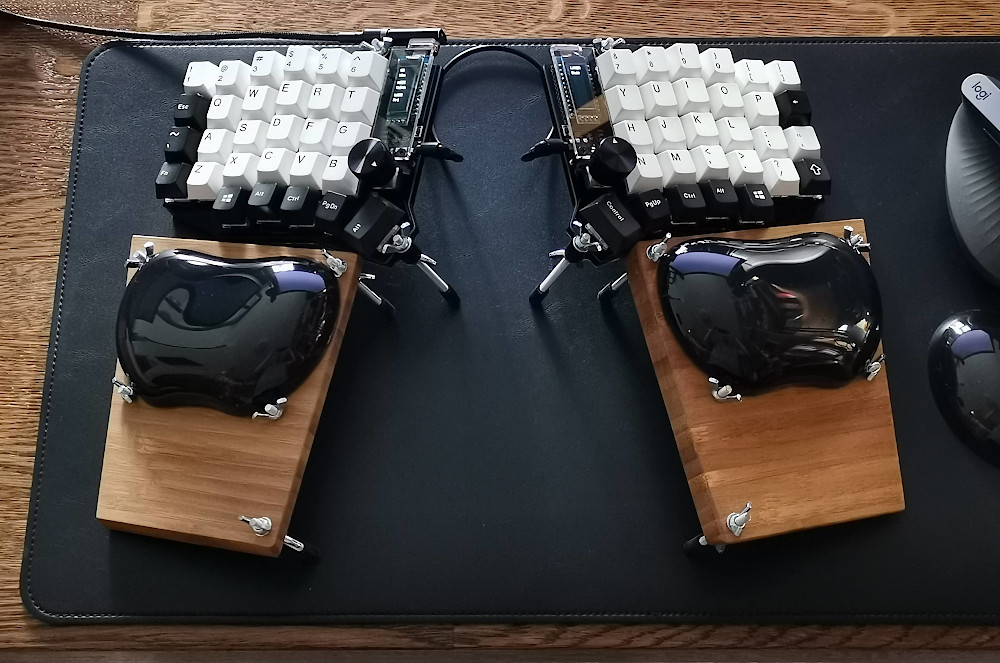

# Firmware for Sofle keyboard

Derived from the [default keymap](https://github.com/qmk/qmk_firmware/tree/master/keyboards/sofle/keymaps/default).



## How to flash

The following recipe is for Fedora 36.

```bash
mkdir qmk
cd qmk
git clone https://github.com/sekogan/my_qmk_keyboards
git clone https://github.com/qmk/qmk_firmware
cd qmk_firmware
git checkout 0.15.11
```

NOTE: more recent versions of QMK are not compatible with the language feature.
It was broken somewhere between 0.15.11 and 0.16.9.

```bash
cd ..
virtualenv venv
. venv/bin/activate
pip3 install qmk
pip3 install keymapviz
QMK_HOME=./qmk_firmware qmk setup
```

Answer yes to all questions.

Copy udev rules to /etc if suggested by qmk setup:

```bash
sudo cp qmk_firmware/util/udev/50-qmk.rules /etc/udev/rules.d/
sudo udevadm control --reload-rules
```

```bash
cd my_qmk_keyboards/sofle
make flash
```
